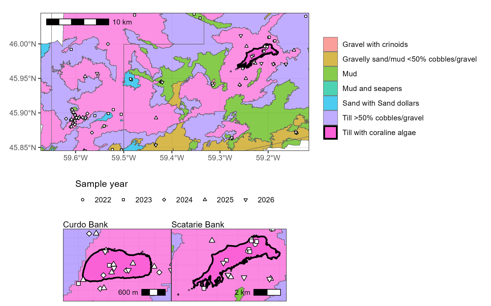

# stannsbank_edna_biodiversity
Analysis of diversity and species turnover in the St. Anns Bank Marine Protected Area through environmental DNA (eDNA)

__Fig 1.__ eDNA sampling stations within the [St. Anns Bank Marine Protected Area](https://www.dfo-mpo.gc.ca/oceans/mpa-zpm/stanns-sainteanne/index-eng.html). 

__Fig 2.__ eDNA sampling stations within the St. Anns Bank Marine Protected Area. Top row shows the Benthoscape classification based on benthic habitat characteristics and epibenthic biodiversity [(Lacharite and Brown 2019)](https://doi.org/10.1002/aqc.3074). Bottom row focuses on two focal features (Curdo and Scatarie Bank).